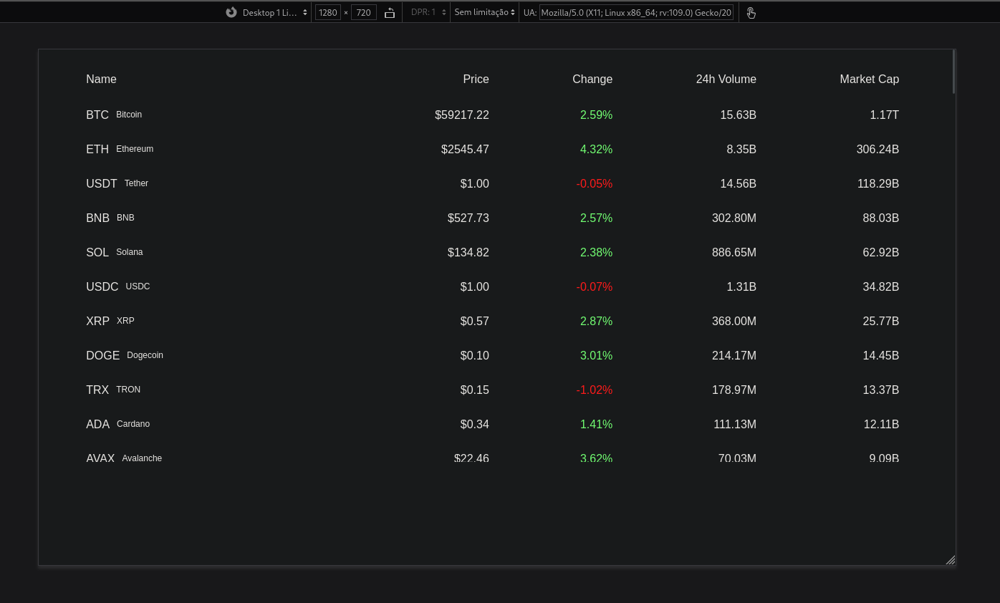
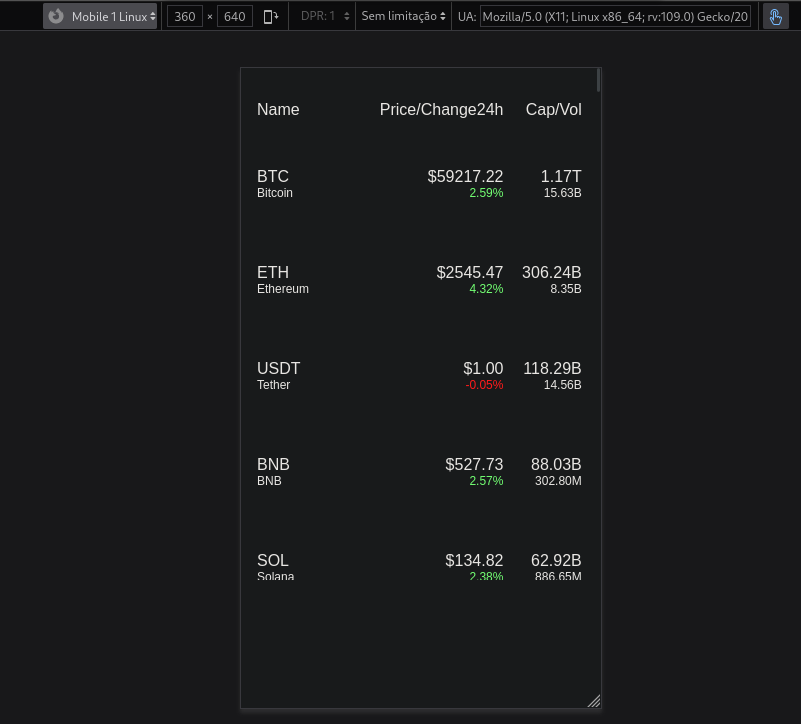

# crypto-list

Projeto criado com o intuito de aprender sobre metodos assíncronos e como consumir API's. O projeto consiste em uma lista das 100 criptomoeadas mais populares

Optei pela CoinCap API 2.0, cuja documentação está disponível em https://docs.coincap.io/.

Como o foco principal do projeto foi JavaScript, o design da página foi mantido simples, com um layout básico apenas para garantir a organização visual dos itens.

## Screenshots

